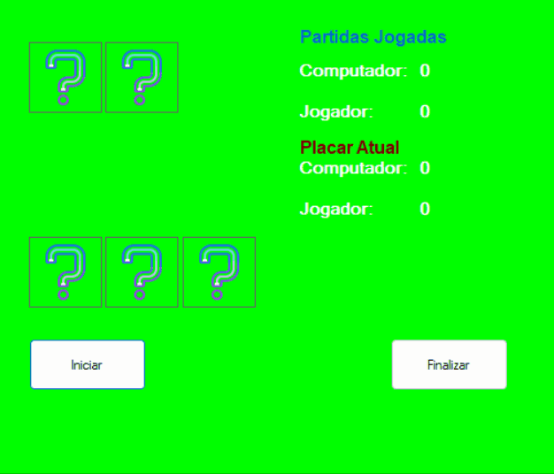

# Jogo similar ao 21

Projeto proposto como uma atividade na Etec de Embu, utilizando a linguagem C# como ferramente e também Windows Forms.

## 📃 Regras do jogo
Dois dados para o computador, com valor oculto.
Para o jogador, são exibidos os valores de dois dos seus cinco dados e a soma aparece no placar. O terceiro dado fica oculto até que o jogador clique. Ao clicar no terceiro dado, o seu valor é gerado, exibido e totalizado, e um quarto dado é disponibilizado para clique. O comportamento do quarto dado é similar, disponibilizando o quinto dado.
A qualquer momento o jogador pode clicar no botão Finalizar, que exibirá os valores dos dados do computador e indicará o vencedor, onde vencedor é aquele que obtiver a maior soma dos dados, desde que não estoure o máximo de 13. Como o computador joga apenas com 2 dados, em caso de empate será apontada a vitória para o computador.
Para um bom funcionamento, o botão Finalizar é desabilitado após clicado. E só volta a ser ativado quando o botão Iniciar for clicado. Igualmente, o botão Iniciar é desabilitado ao ser clicado, e permanece desabilitado até que o o botão Finalizar seja clicado.
Também, cada dado clicável (dado3, dado4 e dado5) deve ser desabilitado após clicado, para não permitir que o jogador clique duas vezes no mesmo dado.
O botão iniciar deve reestabelecer sempre o estado inicial do jogo, zerando o placar, virando dois dados para o jogador, ocultando os valores dos dados do computador, tornando invisíveis os dados 4 e 5, e permitindo o clique no dado3 cujo valor estará inicialmente oculto.
Adicionalmente, o jogo também aponta um outro placar, composto de partidas jogadas, onde o vencedor será aquele que ganhar 3 de 5 partidas.

## 🛠️Tecnologias

* C#
* Windows Forms
* SharpDevelop e Visual Studio

## 📞 Contato

pedrohgs2004@gmail.com  
Linkedin: https://www.linkedin.com/in/pedro-henrique-g-silva-a2100a23a/?originalSubdomain=br
